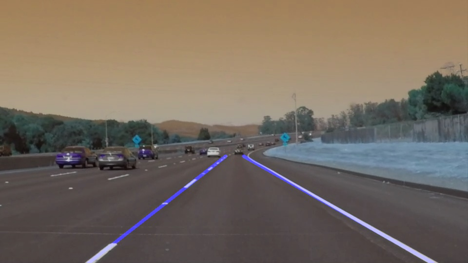

## Finding Lane Lines on Road
The goal of this project is to detect lane markers on the road.


## Pipeline
The pipeline consists of:\
[1] Split the video file into frames\

[2] Remove Noise using gaussian blur\

[3] Apply Canny detection to identify the edge points\

[4] Select the region of interest to avoid irrelevant egdes\ 

[5] Apply Hough transform to get lines passing thorugh egde points\

[6] Draw the lines using numpy polyfit function
 


## Results



[](https://youtu.be/il2HzE08-TQ)

## Dependencies

[1] OpenCV\
[2] Numpy \
[3] Movie.py


## Run Instructions
```bash
jupyter notebook
```

## Possible Improvements
[1] Find more stable parameters for the hough transform function

[2] Improve the pipeline so that it performs well when the Lane Lines appear to be curved.

[3] Get rid of the flickering lines in some of the frames. 
 

## License

MIT 

 
